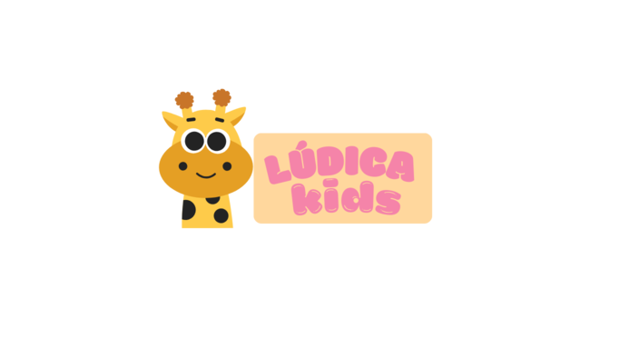

# site-informativo-saude-mental
## LÚDICA KIDS

## Sobre o Lúdica Kids
> "Brincar para acalmar, aprender para crescer."
O **Lúdica Kids** é uma plataforma digital voltada ao desenvolvimento infantil por meio de atividades interativas, educativas e lúdicas. O sistema busca promover o aprendizado de forma leve, divertida e acessível, estimulando habilidades cognitivas, emocionais e sociais das crianças.

---

## Funcionalidades

### 👨‍👩‍👧 Para Responsável
- Cadastro e gerenciamento de perfil da criança  
- Acompanhamento do progresso nas atividades  
- Relatórios de desempenho  
- Controle de tempo de uso  
- Acesso a conteúdos educativos e orientações  

### 🧒 Para Criança
- Jogos educativos interativos  
- Atividades lúdicas de aprendizado  
- Interface amigável e intuitiva  
- Recompensas e incentivos por progresso  
- Conteúdos visuais e sonoros atrativos  

---

## Objetivo Geral
Desenvolver uma plataforma digital interativa que auxilie no aprendizado infantil por meio de atividades lúdicas, promovendo o desenvolvimento cognitivo, emocional e social das crianças.

---

## Objetivos Específicos
- Estimular o aprendizado por meio de jogos educativos  
- Facilitar o acompanhamento do desenvolvimento infantil pelos responsáveis  
- Promover o uso consciente da tecnologia  
- Desenvolver habilidades como memória, atenção e raciocínio lógico  
- Criar um ambiente digital seguro e acessível

---

## Tecnologias Utilizadas
- HTML  
- CSS  
- JavaScript  

---

## Autores
Projeto desenvolvido por alunos da FATEC:
- GIOVANNA MONTORO BARBOSA
- LARA ANTUNES SOARES BRITO
- MARIA APARECIDA BEZERRA DE NORONHA

---
## Portfólio
Este projeto faz parte do portfólio acadêmico, demonstrando habilidades em:
- Desenvolvimento web  
- Design de interfaces  
- Experiência do usuário (UX)  
- Organização e estruturação de projetos  

---

